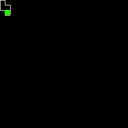

## Maze ganeration

A simple maze generation simulator using the recursive backtracker algorithm. [More details about the algorithm](https://en.wikipedia.org/wiki/Maze_generation_algorithm#Recursive_backtracker)

<p align="center">
    
</p>

### Installing

For the execution of this project it is necessary to install the library [pygame](https://www.pygame.org), we can perform the installation by running the command line below:
```shell
$ pip3 install requirements.txt 
```

### Usage

- Run
```shell
$ python maze.py
```
